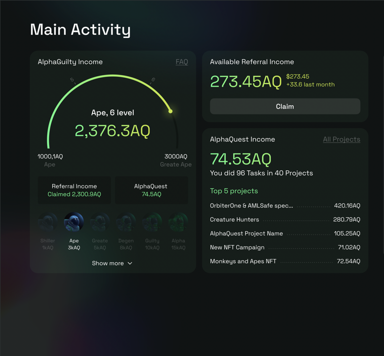

# Тестовое задание в команду AlphaGuilty на позицию front-end React developer

Основной твоей обязанностью будет разработка личного кабинета для наших клиентов. Фронтовая часть написана на react/redux/redux-saga. На бекенде - nest/postgres.

В рамках тестового задание мы предлагаем тебе реализовать упрощенную версию главного дашборда личного кабинета.

Макет по [ссылке](https://www.figma.com/file/NL1rO6tOhyAq6oUkeHYV5T/AlphaGuilty-Test-Task?node-id=0%3A1&t=lBXnVas0LIZDlxk8-1).

От тебя требyется:

- Сверcтать макет (необязательно pixel perfect);
- Написать фронтенд на react-стеке;
- Поднять веб-сервер на Nest.js, который будет отдавать нужные данные на фронт (данные в файле `data.json`).

P.S. Оценивать будем умение выполнять задачу имея неполные данные о ней, а также умение самостоятельно принимать решения, написание читабельного и качественного кода на React и качество вёрстки.

